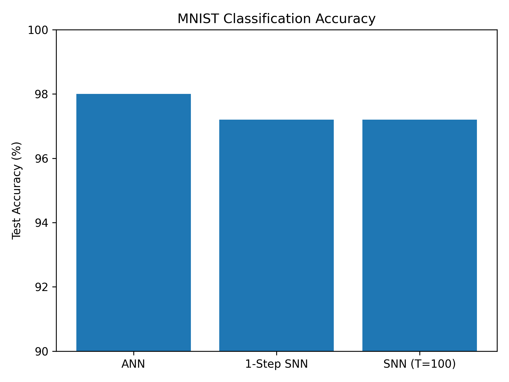
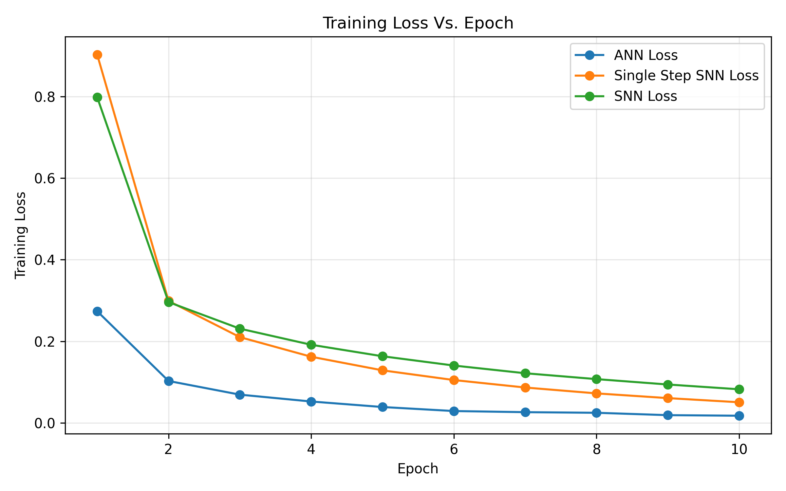
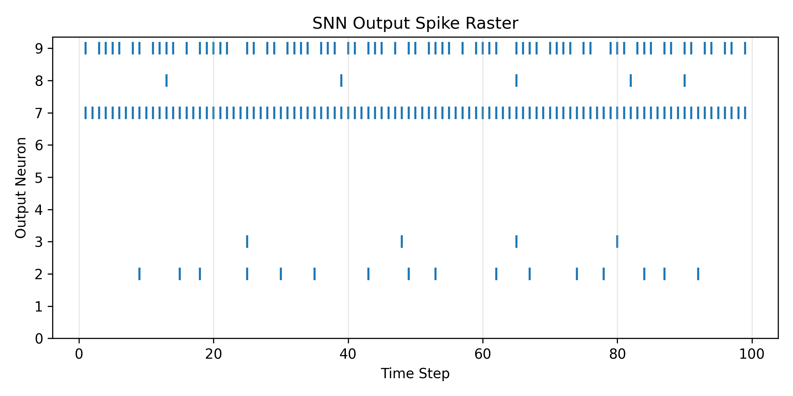

# snn-mnist-classifier-project

This repository contains a personal project exploring **spiking neural networks (SNNs)** using [PyTorch](https://pytorch.org/) and [snnTorch](https://snntorch.readthedocs.io/).  
The goal is to build and train a simple SNN to classify handwritten digits from the **MNIST** dataset and compare its behavior to a standard artificial neural network (ANN) baseline.
I will also include a single step SNN as another baseline comparison that has relatively similar accuracy to the ANN baseline.

This project is part of my self-study in **neuromorphic computing, spiking neural networks, and machine learning**.

---

## Project Goals

- Implement a basic spiking neural network for MNIST digit classification.
- Experiment with:
  - Different spike encoding schemes (e.g., rate coding).
  - Simple neuron models (e.g., Leaky Integrate-and-Fire).
- Compare:
  - SNN performance and training dynamics vs. a standard ANN baseline.
- Build a clean, well-documented project that can be shared on my resume and GitHub.

---

## Technologies Used

- **Language:** Python
- **Frameworks:** PyTorch, snnTorch
- **Dataset:** MNIST (via `torchvision.datasets.MNIST`)
- **Environment:** VS Code / Python virtual environment

---

## Model Architectures

This project compares three related models on the MNIST handwritten digit dataset:
a standard feedforward ANN, a single–step SNN, and a temporal (multi–step) SNN.

### 1. Feedforward ANN Baseline

**Type:** Standard fully connected neural network  
**Input:** 28×28 grayscale image → flattened to 784-dim vector  

**Layer stack**

- Linear(784 → 256)
- ReLU
- Linear(256 → 128)
- ReLU
- Linear(128 → 10) → logits (passed to `CrossEntropyLoss`)

**Key details**

- No time dimension — each image is processed in a single forward pass.
- Optimizer: Adam (lr = 1e-3), batch size = 128, epochs = 10.
- Serves as the non-spiking baseline for accuracy and training behavior.

---

### 2. Single-Step SNN Baseline

**Type:** LIF-based SNN with a single simulation step  
**Input:** 28×28 image → flattened to 784-dim vector (no spike encoding)

**Layer stack**

- Linear(784 → 256) → LeakyLIF
- Linear(256 → 128) → LeakyLIF
- Linear(128 → 10) → LeakyLIF (with `output=True` to get membrane + spikes)

**Key details**

- Only **one** time step is simulated: the image is passed through the LIF layers once.
- The final layer’s **membrane potential** is used as the logits for `CrossEntropyLoss`.
- Same training setup as the ANN (Adam, batch size 128, epochs 10), but with spiking
  neurons replacing ReLU.

---

### 3. Temporal SNN (Multi-Step SNN)

**Type:** LIF-based SNN with rate-encoded inputs and multiple time steps  
**Input pipeline**

1. Image: 28×28 → flatten to 784
2. Rate encoding with `spikegen.rate` to produce a spike train:
   - Shape: **[T, batch, 784]**, where `T = num_steps` (e.g., 100)

**Layer stack per time step**

For each time step `t`:

- Linear(784 → 256) → LeakyLIF
- Linear(256 → 128) → LeakyLIF
- Linear(128 → 10) → LeakyLIF (with `output=True`)

**Readout**

- The network records membrane potentials `mem_rec` over all time steps:
  - Shape: **[T, batch, 10]**
- Classification logits are obtained by time-averaging:
  - `logits = mem_rec.mean(dim=0)` → shape **[batch, 10]**
- These logits are passed to `CrossEntropyLoss`.

**Training setup**

- Time steps: num_steps = 100
- Optimizer: Adam (lr = 1e-4)
- Batch size: 128
- Epochs: 5-10 (10 used for the accuracy comparison results)

---

## Running the models

From the project root:

```bash
# Train and evaluate the ANN baseline
python -m scripts.train_ANN_baseline

# Train and evaluate the single step SNN baseline
python -m scripts.train_single_step_baseline

# Train and evaluate the SNN model
python -m scripts.train_SNN
```
---
**Data Flowchart For Temporal SNN**


---

## Repository Structure

```text
snn-mnist-classifier-project/
├── models/
│   ├── snn_model.py          # SNN architecture definitions
│   ├── mnist_single_step_snn_baseline.py    # single step SNN model for comparison
│   └── mnist_ann_baseline.py       # ANN model for comparison
├── scripts/
│   ├── train_snn.py              # main SNN training script
│   ├── train_single_step_baseline.py    # single step SNN baseline training script
│   └── train_ann_baseline.py     # ANN baseline training script
├── result_scripts/
│   ├── classification_accuracy.py    # bar graph comparison code
│   ├── plot_loss_curves.py        # graph of model comparing training loss code
│   └── snn_spike_raster.py       # raster plot of spikes code
├── results/
│   ├── classification_accuracy.png    # bar graph of all model accuracies compared
│   ├── training_loss_curves.png        # cpmarison graph of all model losses
│   └── snn_output_spikes.png       # raster plot of spikes during simulation of temporal snn
├── requirements.txt          # Python dependencies
└── README.md                 # project documentation
```

---

## Setup

A basic Python environment is recommended, but not needed (e.g., virtualenv or venv).

Once `requirements.txt` is complete, dependencies can be installed with:

```bash
pip install -r requirements.txt
```

---

## Project Results

### Model Accuracy Results

| Model         | Timesteps | Epochs    | Test Accuracy | Model Type          |
|---------------|-----------|-----------|---------------|---------------------|
| ANN           | 1         | 10        | 98.0%         | ReLU ANN            |
| 1-step SNN    | 1         | 10        | 97%           | LIF SNN             |
| SNN Model     | 100       | 10        | 97%           | LIF SNN             |



---

### Training Loss Curves



---

### SNN Model Spike Raster



---

## Final Results & Interpretation
This project compares three models on the MNIST digit classification task:

- **ANN** – standard 3-layer feedforward network with ReLU activations  
- **Single Step SNN** – LIF spiking network evaluated at a single time step (no explicit temporal dynamics)  
- **SNN Model** – full LIF spiking network unrolled over 100 time steps with rate-encoded input

### Accuracy comparison
From the classification accuracy bar plot:

- **ANN** reaches **≈98%** test accuracy
- **Single Step SNN** reaches **≈97%**
- **Full SNN** reaches **≈97%**

All three models perform strongly on MNIST. The spiking models get very close to the ANN baseline despite using non-differentiable spike events and noisy rate encoding.

### Training dynamics (loss curves)
From the training loss vs. epoch plot:

- The **ANN** and **Single Step SNN** both start with relatively low loss and converge quickly.
- The **full SNN** starts with a much higher loss in the first epoch, then decays more slowly.

This behaviour is expected.
- The full SNN must learn over **100 time steps** with **rate-encoded spike trains**, so its gradients are weaker and noisier.
- The ANN and Single Step SNN see a **clean, static input** and take larger effective gradient steps, so they reach low loss faster.

By the final epochs, the SNN’s loss approaches the same regime as the non-spiking baselines, showing that a simple rate-encoded SNN can achieve competitive performance.

### Spike-based computation (raster plot)
The spike raster plot of the SNN’s output layer over time shows:

- Spikes distributed sparsely across time, rather than continuous activations.
- Different output neurons (digit classes) firing with different intensities over the 100 steps.
- The neuron corresponding to the correct label tends to fire more consistently than others.

This illustrates the key difference between the ANN and SNN models:  
instead of working with continuous activations at a single time step, the SNN represents information as **spike trains over time**, which could be more energy-efficient on neuromorphic hardware compared to an ANN.

### Conclusion

- On MNIST, simple SNNs can get very close to ANN-level accuracy with the right training setup.
- Adding temporal structure (100-step SNN) makes optimisation harder but allows us to study genuinely spiking behaviour.
- The combination of all the listed data graphs provide a compact view of how ANNs and SNNs differ in both performance and dynamics.

---
## License

This project is licensed under the terms of the **MIT License**.  
See the [`LICENSE`](./LICENSE) file for details.
